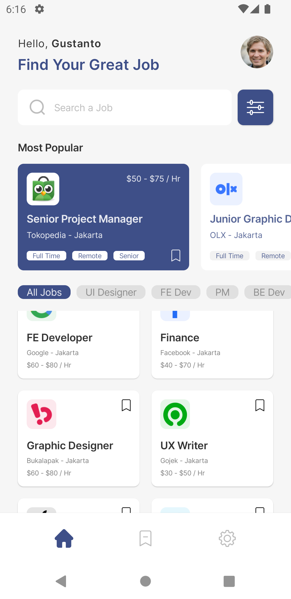

# Designs
- A collection of designs implemented using Android's new UI toolkit Jetpack Compose.
- Improvisations were sometimes necessary and therefore made.
- The code is not "production" ready as
  the UI is done rather very quickly, in a prototype manner so to say.
- Projects are done with different level of Compose knowledge I had at the time of writing them.

## Doctors
* Design author: Gilang Segara
* Design location: https://www.figma.com/community/file/867963472996705280
* App screenshots:

  
  

## Job Finder
* Design author: Gustanto Syaputra
* Design location: https://www.figma.com/community/file/1074872535311759131
* App screenshots:

  
  
  

## Healthcare
* Design author: Boro
* Design location: https://dribbble.com/shots/18303918-Care-Me-App-Onboarding
* App presentation:

  

